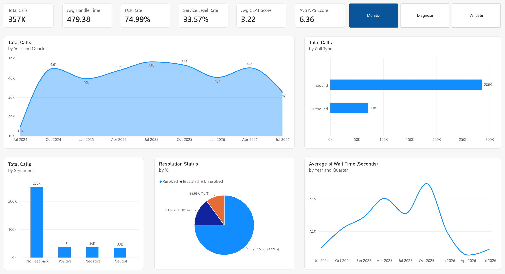

# dbt Contact Center Analytics

A dbt project that transforms raw contact center data into clean, tested, and documented models for analytics and reporting.

---

## What This Project Does

This project takes raw data from a contact center (calls, agents, surveys) and transforms it into useful tables for analysis. It follows dbt best practices with staging, intermediate, and mart layers.

### What You Get
- Clean staging tables from raw sources
- Intermediate tables with business logic applied
- Dimension and fact tables ready for reporting

### Key Metrics
- Call volume (inbound / outbound)
- Average handle time
- Wait times
- First-call resolution rate
- Service level (calls answered within 30 seconds)
- CSAT and NPS scores
- Agent performance metrics

---

## Live Dashboard

The data feeds into a Power BI dashboard for real-time visibility.

👉 **[View Power BI Dashboard](https://app.powerbi.com/view?r=eyJrIjoiY2EyY2RhYjUtNjRhNC00MDRmLWE1NzEtMzc4NDVmNGFmMDc0IiwidCI6IjJmODc0OTkzLTM0ZGMtNGVkZi1iNmRhLTZkMzllMjAyYzFlNyIsImMiOjEwfQ%3D%3D)**

[](https://app.powerbi.com/view?r=eyJrIjoiY2EyY2RhYjUtNjRhNC00MDRmLWE1NzEtMzc4NDVmNGFmMDc0IiwidCI6IjJmODc0OTkzLTM0ZGMtNGVkZi1iNmRhLTZkMzllMjAyYzFlNyIsImMiOjEwfQ%3D%3D)

---

## Project Structure

```text
models/
├── staging/contact_center/
│   ├── stg_agents.sql
│   ├── stg_calls.sql
│   └── stg_surveys.sql
├── intermediate/
│   ├── int_daily_call_metrics.sql
│   └── int_surveys_cleaned.sql
└── marts/
    ├── dim_agents.sql
    ├── fct_agent_metrics.sql
    ├── fct_call_metrics.sql
    └── fct_daily_call_metrics.sql
```

> **Note:** All models are documented in `models/schema.yml`.

---

## Setup & Installation

### Requirements
- Python 3.11+
- dbt Core
- BigQuery project with service account

### Step 1: Clone the Repository
```bash
git clone [https://github.com/reyan145/dbt-contact-center-analytics.git](https://github.com/reyan145/dbt-contact-center-analytics.git)
cd dbt-contact-center-analytics
```

### Step 2: Set Up Your dbt Profile
Create or update `~/.dbt/profiles.yml`:

```yaml
dbt_contact_center:
  target: dev
  outputs:
    dev:
      type: bigquery
      method: service-account
      project: your-project-id
      dataset: contact_center_data
      threads: 4
      keyfile: /path/to/your-key.json
```

### Step 3: Run the Project
```bash
dbt deps
dbt run
dbt test
```

### Step 4: Generate Documentation
```bash
dbt docs generate
dbt docs serve
```

---

## CI / CD

Every pull request to `main` triggers a GitHub Actions workflow that:
- Installs dbt
- Runs data quality tests
- Validates the project

The workflow uses a GitHub secret called `DBT_BIGQUERY_KEYFILE_JSON` for authentication.

---

## About This Project

This was built as a portfolio project to demonstrate:
- dbt modeling (staging, intermediate, marts)
- Documentation
- Data testing
- CI/CD
- End-to-end pipeline from raw data to dashboard

---

## Author

**Quazi Aritra Reyan**

- GitHub: [@reyan145](https://github.com/reyan145)
- LinkedIn: [Profile](https://linkedin.com/in/your-profile)

---

## License

This project is licensed under the [MIT License](https://opensource.org/licenses/MIT).